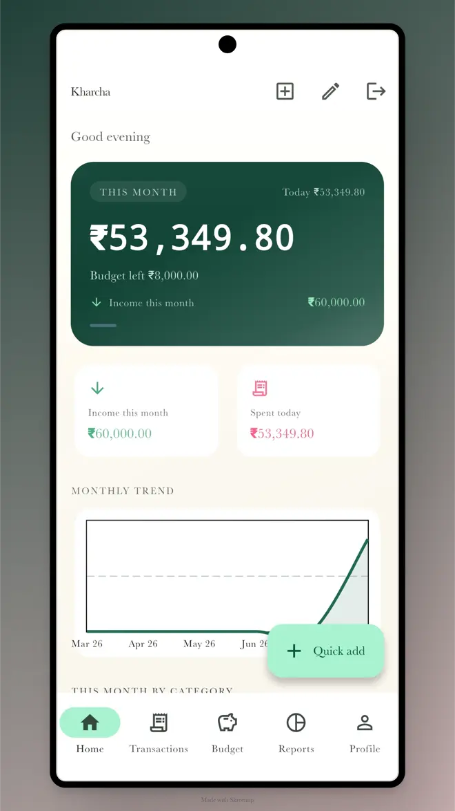
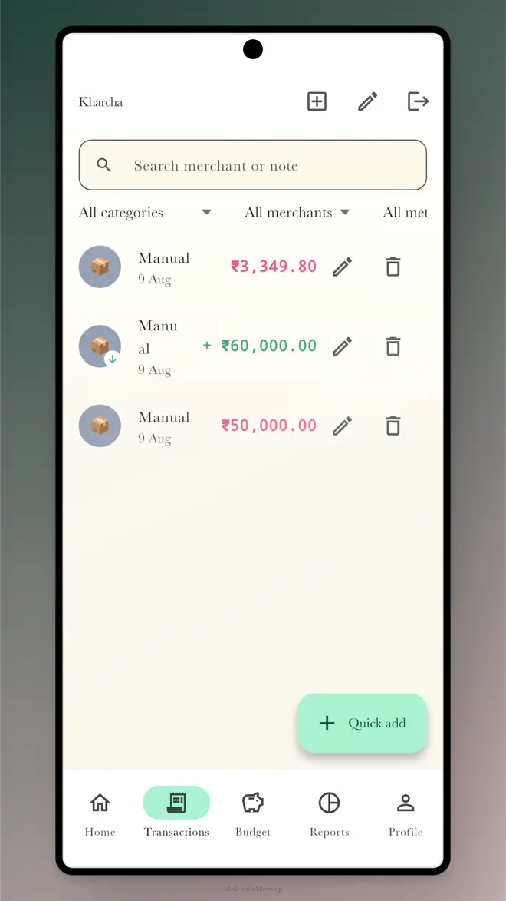
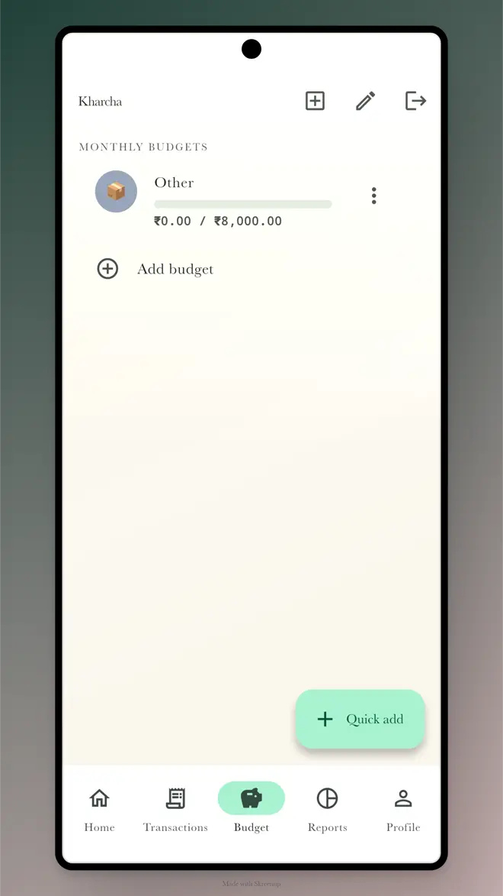
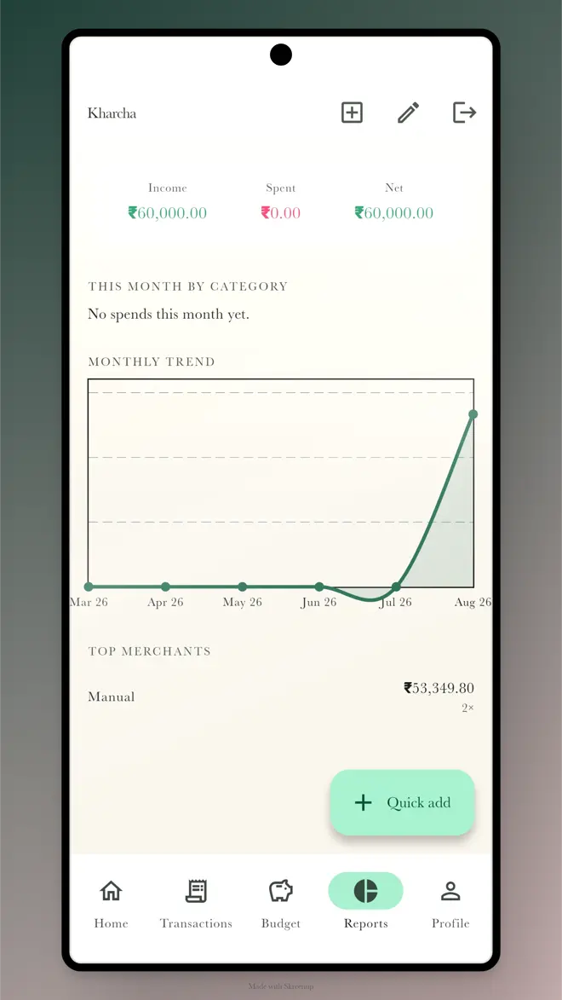
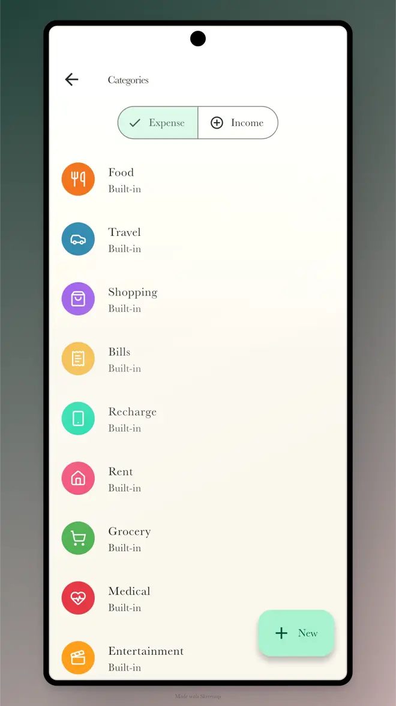
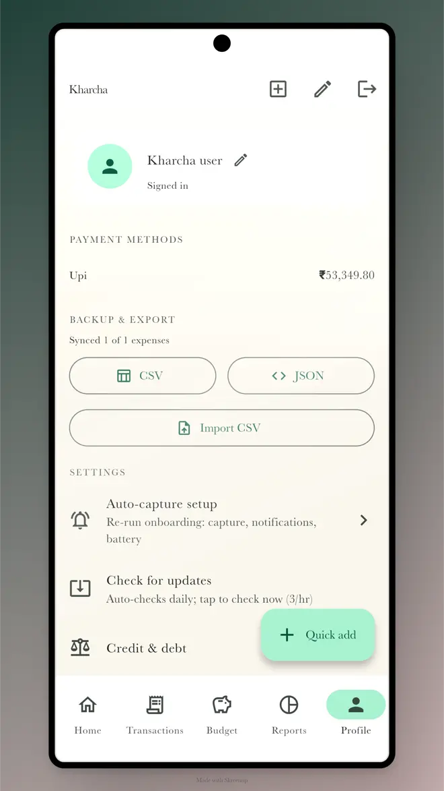

  
  <h1>Kharcha</h1>
  
<strong>India's Zero-Friction UPI Expense Tracker for Android.</strong>

  
  
  

---

**Kharcha** is a native Android expense tracker purpose-built for India's UPI ecosystem. Every payment from **GPay, PhonePe, Paytm, or CRED** is automatically captured, categorized, and added to your ledger instantly without manual entry.

Built with an offline-first architecture, Kharcha relies on **100% deterministic, rule-based automation**—zero AI hallucination, zero manual logging, and absolute data ownership.

**by Akash Priyadarshi & Priyaranjan** · [github.com/AkashPriyadarshii](https://github.com/AkashPriyadarshii) · [github.com/priyaranjan122002](https://github.com/priyaranjan122002) · [akashpriyadarshi.vercel.app](https://akashpriyadarshi.vercel.app)

**🌐 Website:** [**kharcha.github.io**](https://AkashPriyadarshii.github.io/kharcha/) — features, screenshots, FAQ, direct download.

India-first UPI expense tracker for Android. Every UPI payment from GPay, PhonePe, or Paytm auto-appears as an expense — no manual entry. Offline-first, rule-based automation (no AI), Supabase sync. Built with Flutter/Dart, Drift/SQLite.

## 📲 Download

| | |
|---|---|
| **Latest release** | **v0.2.8** |
| **APK** | [kharcha-armv8a-release.apk](https://github.com/AkashPriyadarshii/kharcha/releases/latest/download/kharcha-armv8a-release.apk) (~25 MB) |
| **Requirements** | Android 12+ (arm64) |

**Install:** Download the APK → open it → allow "Install unknown apps" if prompted → done. The app auto-updates itself using GitHub Releases.

## 📸 Interface

| | | |
|---|---|---|
|  |  |  |
|  |  |  |

## ✨ Features

- **Automated UPI & SMS Capture:** Reads push notifications and SMS banking alerts in real-time. Smart deduplication (±2 minute window) ensures you never double-count a transaction.
- **Smart Spam Filter:** Silently ignores OTPs, recharge prompts, loan ads, and failed transactions before they even hit the parser.
- **Ground-Truth Wallet Sync:** Extracted SMS balances act as ground-truth checkpoints, silently correcting your local wallet ledgers.
- **Income Autopay:** Define recurring income/subscriptions; Kharcha automatically processes them in the background on their due dates.
- **Rules Engine (Zero AI):** Fully transparent categorization. Swiggy → Food, Uber → Travel. Add custom regex-based rules to auto-sort your niche merchants.
- **Hinglish Daily Summaries:** Localized 9PM daily check-ins ("Aaj ₹540 kharcha hue") and Sunday weekly recaps.
- **GitHub-Style Heatmaps:** Visualize your spending intensity with deep green activity heatmaps in the Reports tab.
- **Privacy-First Export:** Export your entire database to CSV or JSON with merchant PII auto-hashed for safe spreadsheet analysis.
- **Offline-First:** Your data lives on your device in a Drift SQLite database. Supabase acts strictly as a silent background sync target.
- **Biometric App Lock:** Secure your financial data with fingerprint or PIN protection.

## 🚀 What's New in v0.2.8
- **Automated Crash Reporting:** Zero-dependency, on-device crash caching (AppLogger) that silently reports to Supabase when online. No heavy Sentry/Firebase SDKs.
- **True Balance Extraction:** SMS captures now adjust your wallet's initialBalance directly.
- **Advanced SMS Onboarding:** Optional dual-capture routing for rock-solid transaction detection.
- **Drift SQL Aggregations:** Moved heavy chart calculations (merchant rankings, heatmaps) to native SQLite, eliminating OOM crashes.

## 🛠 Tech Stack

| Concern | Choice |
|---|---|
| Framework | Flutter, Android 12+ (minSdk 32) |
| State & UI | Riverpod, go_router, Material 3, fl_chart |
| Local DB | Drift (SQLite) — *Source of Truth* |
| Cloud / Sync | Supabase (Postgres, Google Auth) |
| Native Plugins | flutter_local_notifications, local_auth |

## 👥 Team
- **Akash Priyadarshi** (AkashPriyadarshii) - *Creator / Lead Developer*
- **Priyaranjan** (priyaranjan122002) - *Collaborator*

*Website: [akashpriyadarshi.vercel.app](https://akashpriyadarshi.vercel.app)*

## 📄 License & Legal
Source-available. All rights reserved. This code is public for viewing only — no use, reproduction, or derivative works permitted. See LICENSE for full terms.
- [Play-listing copy](docs/play-listing.md)
- [Privacy policy](docs/privacy-policy.md)
- [Security Policy](SECURITY.md)

<!-- 
SEO Metadata & Keywords:
UPI expense tracker, expense tracker India, UPI payment tracker, GPay tracker, PhonePe tracker, Paytm tracker, money tracker app, spend tracker India, budget app India, auto expense tracker, SMS expense tracker, payment notification tracker, Kharcha app, personal finance app India, expense manager, money manager India, monthly budget tracker, UPI spend tracker, offline expense tracker, finance app Android.
-->
