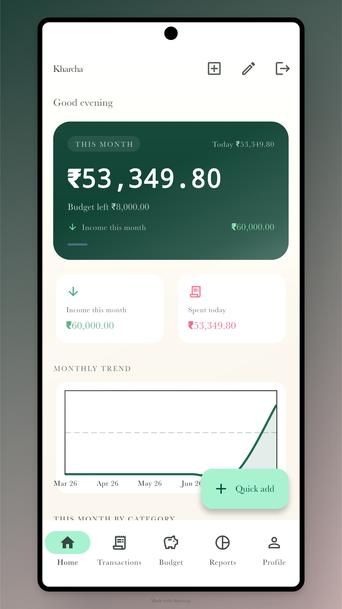
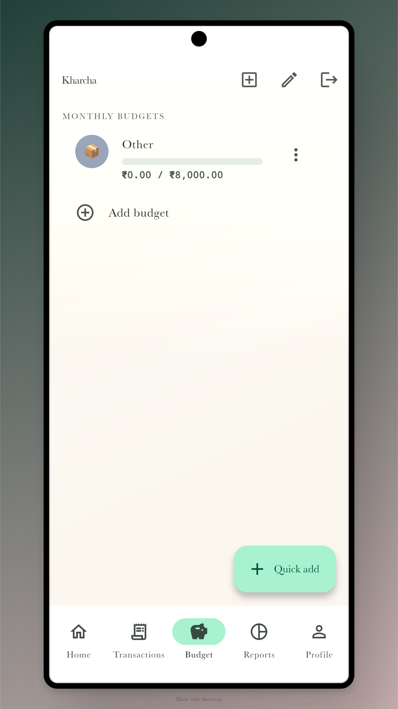
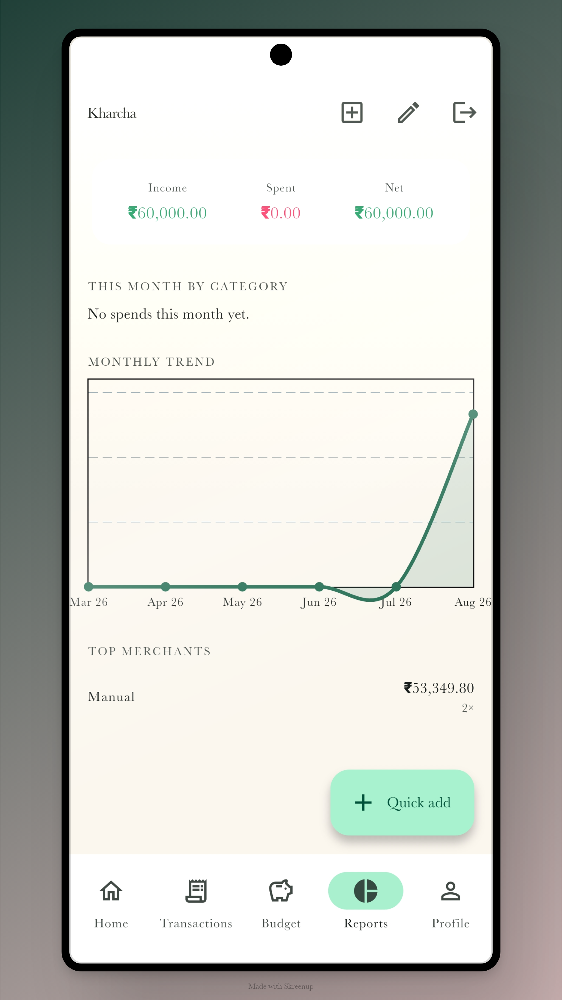
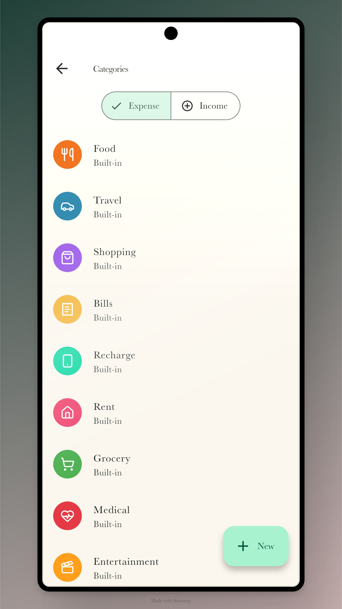
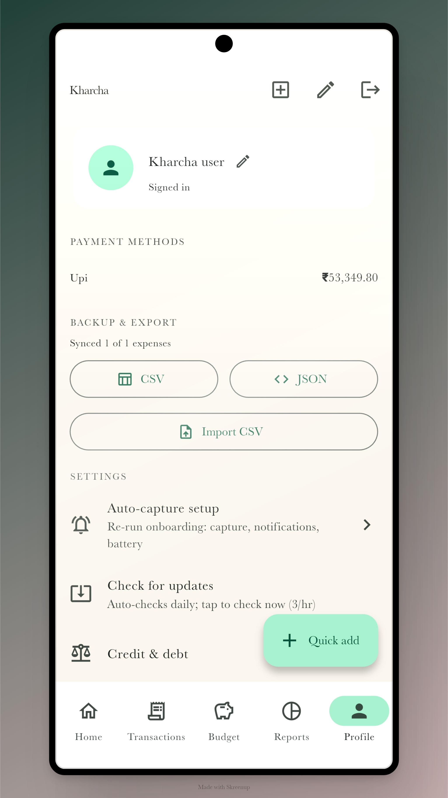

# Kharcha — India's UPI Expense Tracker for Android

**by Akash Priyadarshi & Priyaranjan** · [github.com/AkashPriyadarshii](https://github.com/AkashPriyadarshii) · [github.com/priyaranjan122002](https://github.com/priyaranjan122002) · [akashpriyadarshi.vercel.app](https://akashpriyadarshi.vercel.app)

**🌐 Website:** [**kharcha.github.io**](https://AkashPriyadarshii.github.io/kharcha/) — features, screenshots, FAQ, direct download.

India-first UPI expense tracker for Android. Every UPI payment from GPay, PhonePe, or Paytm auto-appears as an expense — no manual entry. Offline-first, rule-based automation (no AI), Supabase sync. Built with Flutter/Dart, Drift/SQLite.

## 📲 Download

| | |
|---|---|
| **Latest release** | **v0.2.6** |
| **APK** | [`kharcha-armv8a-release.apk`](https://github.com/AkashPriyadarshii/kharcha/releases/latest/download/kharcha-armv8a-release.apk) (~25 MB) |
| **Requirements** | Android 12+ (arm64) |

**Install:** download the APK → open it → allow "Install unknown apps" if prompted → done. The app then auto-updates itself — every release is checked and offered in-app, no sideloading again.

## Screenshots

| | | |
|---|---|---|
|  |  |  |
|  |  |  |

## Product

- **Auto-capture** — reads UPI push notifications (GPay, PhonePe, Paytm) → parses amount/merchant/date → saves expense. Play-legal, no SMS permission.
- **Auto-categorization** — rule map: Swiggy→Food, Uber→Travel, Amazon→Shopping, Reliance→Grocery. Self-learns from user corrections.
- **Duplicate-safe** — `upi_ref` unique; notification + manual can never double-add.
- **9PM Hinglish daily summary** — "Aaj ₹540 kharcha hue." Weekly Sunday recap.
- **Offline-first** — Drift SQLite source of truth, works with zero network, syncs to Supabase when online.
- **Budget alerts** — 50/80/100% per-category.
- **App lock** — biometric/PIN.
- **Max tracking, never sold** — collects granular spend data (that's the product); data is never sold, never ad-targeted.

## What's new in v0.2.6

- **Dark theme** — a full dark mode (warm near-black, same ₹-green identity). Follow your system, or force Light/Dark from Profile → Settings → Theme.
- **In-app bug reporting** — Report a bug in Settings. Email is one tap (opens your mail app, device details pre-filled); an in-app option works too.

## What's new in v0.2.5

- **Notification fixes** — daily/weekly summaries now fire at the right time on every device (timezone fallback), and the weekly recap is no longer silently lost when it lands on a Sunday evening.
- **Name fix** — your Google name now shows correctly after sign-in (was missing for many accounts).

## Tech stack

| Concern | Choice |
|---|---|
| Framework | Flutter, Android 12+ (minSdk 32) |
| UI | Material 3, Riverpod, go_router |
| Local DB | Drift (SQLite) |
| Backend | Supabase (Google Auth, Postgres, sync) |
| Charts | fl_chart |
| Notifications | flutter_local_notifications |
| App lock | local_auth |

## Team

- Akash (`AkashPriyadarshii`)
- Priyaranjan (`priyaranjan122002`)

## License

Source-available. All rights reserved. This code is public for viewing only — no use, reproduction, or derivative works permitted. See LICENSE for full terms.

**Site:** [https://AkashPriyadarshii.github.io/kharcha/](https://AkashPriyadarshii.github.io/kharcha/)

**Description:** Kharcha — India's UPI expense tracker for Android. Every UPI payment from GPay, PhonePe, or Paytm auto-appears as an expense. No manual entry. Offline-first, private, rule-based automation (no AI), Supabase sync.

**Keywords:** UPI expense tracker, expense tracker India, UPI payment tracker, GPay tracker, PhonePe tracker, money tracker app, spend tracker India, budget app India, auto expense tracker, payment notification tracker, Kharcha app, personal finance app India, expense manager, money manager India, monthly budget tracker, UPI spend tracker, finance app Android.

**Meta tags:** `<title>` Kharcha — India's UPI Expense Tracker for Android · `<meta description>` (see above) · Open Graph (`og:title`, `og:description`, `og:image` = HOME screenshot, `og:locale` = en_IN) · Twitter card `summary_large_image` · canonical URL · `theme-color` #0A6B4D · schema.org `SoftwareApplication` JSON-LD (finance category, free, aggregate rating).

**Other links:** [Play-listing copy](docs/play-listing.md) · [Privacy policy](docs/privacy-policy.md)
